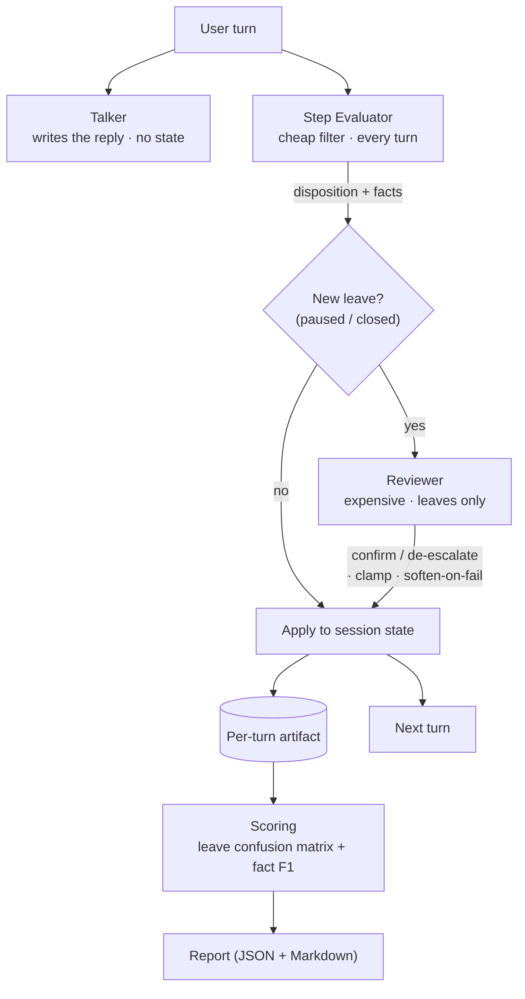

# agent-eval-harness

[](https://github.com/Jesse-Anders/agent-eval-harness/actions/workflows/ci.yml)


> Replay-driven evaluation for a **cost-tiered proposer/reviewer agent cascade**.
> Scenario files, transcript replay, scoring, and regression tests — so a
> multi-agent system is iterated on like software, not vibes.

A cheap first-line agent classifies every turn; an expensive reviewer runs only
on the rare high-stakes "leave" decisions and can only ever *walk a decision
back*. Recorded transcripts are replayed deterministically through the chain and
scored against declared expectations, and the whole suite runs green in CI with
no API key. This is the pattern I use to push a multi-LLM chain to high accuracy
while paying for the expensive model only where it changes the answer.

## Architecture



Full write-up, including the asymmetric-error model, in
[docs/architecture.md](docs/architecture.md).

## Quickstart (no API key needed)

```bash
git clone https://github.com/Jesse-Anders/agent-eval-harness && cd agent-eval-harness
pip install -e ".[dev]"
make test                                        # 51 tests, offline, no credentials
make replay SCENARIO=scenarios/topic_switch.json # replay the adversarial case (fake LLM)
make report                                       # replay all scenarios + print the summary
```

`make test` and every replay above use a deterministic `FakeLLM` seeded from
fixture files, so there is nothing to configure. To run the same scenarios
against a real model, install the extra and set the provider:

```bash
pip install -e ".[bedrock]"
EVAL_HARNESS_PROVIDER=bedrock make report        # needs AWS credentials
```

## What the adversarial scenario demonstrates

`scenarios/topic_switch.json`: the customer says *"oh that's sorted now, thanks!
— wait, actually the CSV export is also broken."* The cheap filter reads
"thanks, sorted" as a **close** — a false positive. The reviewer sees the topic
switch and reverts it, keeping the session open. Here is the actual
`make report` output:

```
5/5 scenarios pass · 17 labeled turns · 1 false-positive leave recovered by the reviewer

Leave-detection accuracy (all scenarios)

| stage                  | tp | fp | fn | tn | recall | precision |
|------------------------|----|----|----|----|--------|-----------|
| stage 1 (cheap filter) |  2 |  1 |  0 | 14 |  100%  |    67%    |
| after reviewer         |  2 |  0 |  0 | 15 |  100%  |   100%    |
```

The filter never misses a real leave (**recall stays 100%**), and the reviewer
lifts **precision from 67% to 100%** by removing the false positive — the entire
value of the second stage, quantified. The per-scenario section shows the
correction itself:

```
topic_switch — PASS
- final: disposition=continue step=gather_environment turns=4
- reviewer corrections:
    - turn 2: closed → continue (revert_to_continue)
```

And `scenarios/reviewer_failsoft.json` shows the safety property: when the
reviewer returns malformed output on a proposed close, the system softens it to
`paused` rather than trust the cheap model — `turn 1: closed → paused
(soften_fail_closed_to_paused)`.

### Prompts are versioned; regressions are measurable

`make compare SCENARIO=scenarios/topic_switch.json PROMPTS=v1,v2` runs two prompt
versions over the same transcript. Here `v2` tightens the filter's leave rule so
it no longer misreads the topic switch — every decision stays correct, but the
expensive reviewer is no longer needed:

```
| version | result | expensive reviewer calls |
|---------|--------|--------------------------|
| v1      | PASS   |            1             |
| v2      | PASS   |            0             |
```

That is a prompt change reviewed like a code change: same outcomes, lower cost,
proven by replay.

## Design notes

- **Prompts as versioned code.** Every prompt is a builder function with an
  explicit version, so a prompt change is a reviewable diff and can be A/B'd.
- **Evaluators don't write dialogue.** The talker generates text; the evaluator
  and reviewer only decide state. Roles can't leak into each other.
- **Reviewer constraints.** The reviewer runs only on a *new* proposed leave, and
  the state machine clamps it so it can confirm or de-escalate but never
  escalate — structurally unable to introduce the unrecoverable error class.
- **JSON with repair.** Strict-JSON agents get one repair pass on malformed
  output; a second failure returns `None` and triggers fail-soft, never a crash.
- **Fail-soft.** When the reviewer can't run, a close is softened to a pause.
- **Deterministic replay.** A fresh synthetic session id each run; identical
  decisions and scores every time, no network.
- **Least-privilege context.** Each agent sees only the context fields it
  declares.

## Layout

```
src/eval_harness/
  agents/    talker · step_evaluator · reviewer · prompts · context_policy
  llm/       client (interface) · fake · bedrock
  state/     machine (ladder + clamp + soften) · session
  replay/    runner · scoring · report
  json_repair.py
scenarios/   *.json  transcript + expected outcomes (1 adversarial)
fixtures/    *.json  recorded FakeLLM responses per scenario
tests/       state machine · json repair · reviewer guardrails · replay e2e · scoring
docs/        architecture.md
```

## Attribution

Pattern extracted and generalized from a production multi-agent system I built;
product specifics, prompts, and data are omitted.

## License

MIT — see [LICENSE](LICENSE).
