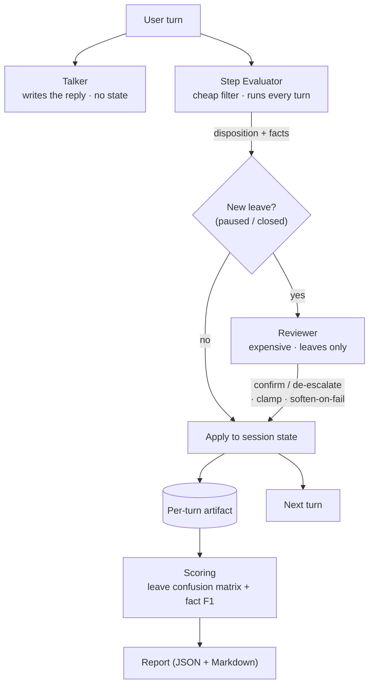

# Architecture

## The cascade

Every user turn flows through three agents with strictly separated jobs:

The **replay runner** drives this loop turn-by-turn over a recorded transcript
with a fresh synthetic session id, writing an artifact per turn. **Scoring**
compares the run against the scenario's declared expectations; **report**
renders the result.

## Why the roles are split

- **Talker** writes dialogue and nothing else. Keeping generation away from
  state decisions means a prompt tweak for tone can never accidentally move the
  state machine.
- **Step evaluator** is the cheap, always-on first-line filter. It proposes a
  disposition and extracts facts.
- **Reviewer** is the expensive final adjudicator. It runs *only* when the
  evaluator proposes a new leave, and it can only advise — the state machine,
  not the reviewer, applies the decision.

## The asymmetric-error model (the point)

Treat "leave the session" (`paused`/`closed`) as the positive class.

- A **false negative** — the filter says "keep going" when the truth was a leave
  — is **unrecoverable**: the reviewer never runs on a non-leave, so nothing
  downstream can catch it. The filter is therefore tuned for **recall ≈ 1.0**,
  deliberately *over*-proposing leaves.
- That bias manufactures **false positives** on purpose. Those are the cheap,
  recoverable error: the reviewer removes them, supplying **precision**.
- The **clamp** (`state/machine.py`) guarantees the reviewer can only walk a
  decision *down* the commitment ladder (`continue < paused < closed`), never
  up. So stage 2 can never turn a correct "stay" into a leave — it is
  structurally incapable of introducing a false negative, and stage 1's recall
  guarantee survives untouched.
- **Soften-on-failure** biases the same way: if the reviewer cannot run, a
  proposed `closed` becomes `paused` (park, don't commit).

The report makes this legible as a confusion matrix over the leave class,
computed for the raw filter proposals and again after the reviewer — the delta
is exactly what the expensive model buys.

## Components

| Path | Responsibility |
|---|---|
| `agents/talker.py` | Customer-facing message; no state. |
| `agents/step_evaluator.py` | Cheap filter: propose disposition + extract facts. |
| `agents/reviewer.py` | Expensive adjudicator for proposed leaves only. |
| `agents/prompts.py` | Versioned prompt builders (prompts are code). |
| `agents/context_policy.py` | Least-privilege context projection per agent. |
| `state/machine.py` | Disposition ladder, clamp, soften-on-failure. |
| `state/session.py` | Per-run state + fresh synthetic id + state deltas. |
| `json_repair.py` | Lenient parse + one repair pass; never raises on the hot path. |
| `llm/client.py` | The single interface every agent depends on. |
| `llm/fake.py` | Deterministic scripted client for tests/offline replay. |
| `llm/bedrock.py` | Real provider adapter with model tiering. |
| `replay/runner.py` | Turn-by-turn replay + per-turn artifacts. |
| `replay/scoring.py` | Leave confusion matrix + fact-alignment F1. |
| `replay/report.py` | JSON + readable Markdown/console report. |

## Not included

This harness generalizes a pattern; a few things from the original production
system are deliberately left out to keep it small and domain-neutral:

- **Graph / vector memory.** The original scored extracted relationships against
  a graph; here that is simplified to flat fact-set alignment (F1), with no
  graph-database dependency.
- **Remote trace storage.** Artifacts are written to a local directory only; no
  object-store or cloud trace sink.
- **Coverage / summarization sub-agents.** The real flow runs additional agents
  around the evaluator; they are orthogonal to the proposer/reviewer cascade and
  omitted for focus.
- **Time-budget scheduling.** Production gates the reviewer on remaining request
  budget; the fail-soft path is modeled, the wall-clock scheduler is not.

## Attribution

Pattern extracted and generalized from a production multi-agent system I built;
product specifics, prompts, and data are omitted.
